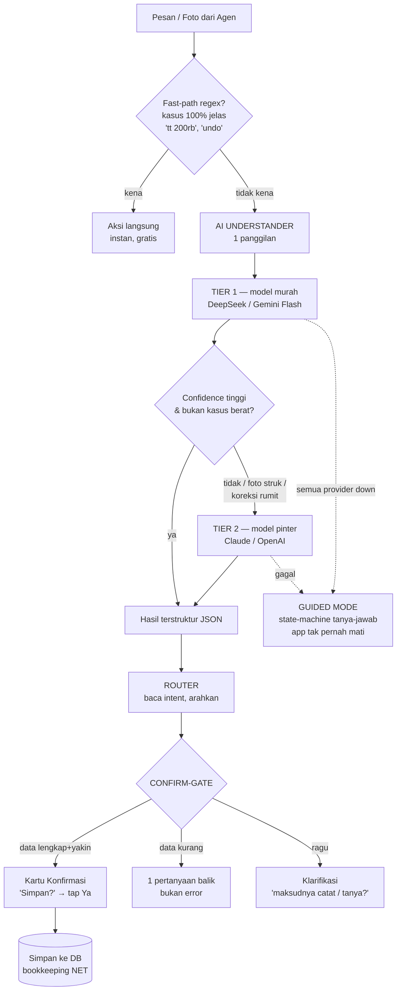
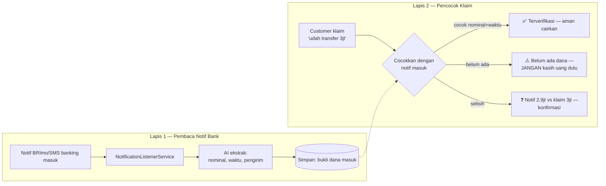
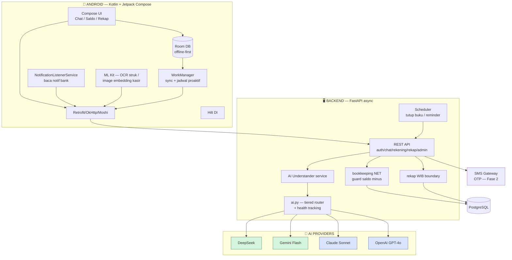

# Klik Agen — PRD Visioner & Desain Arsitektur AI

**Status:** Design (disetujui per bagian) | **Tanggal:** 2026-07-01 | **Menggantikan:** `klik-agen-mini-prd.md`

> Dokumen ini adalah hasil brainstorming ulang. Ia mendefinisikan **visi**, **arsitektur AI**, dan **model bisnis** Klik Agen — dari MVP agen solo hingga platform kasir visual. Setiap keputusan di sini sudah divalidasi bersama pemilik produk.

---

## 1. Ringkasan Eksekutif

**Klik Agen** adalah asisten AI untuk **agen BRILink & pemilik toko** di Indonesia. Filosofi tunggal: **segampang gesek ATM** — agen gaptek cukup ngobrol natural atau kirim foto, semua urusan bisnis beres. Tidak ada form panjang, tidak ada menu ribet, tidak perlu belajar.

Produk berdiri di atas **tiga pilar**:

| Pilar | Peran | Kalimat |
|---|---|---|
| 🥇 **Chat AI segampang ATM** | HERO — alasan pindah | "Catat transaksi cukup ngobrol." |
| 🛡️ **Perisai anti-tipu** | Pendukung — hook viral | "Bikin kamu gak ketipu bukti transfer palsu." |
| 🧠 **Otak keuangan proaktif** | Pendukung — mesin retensi | "Jagain cuan kamu, ngomong duluan pas bahaya." |

Diikat satu benang: **agen gaptek berhenti rugi diam-diam, cukup lewat chat.**

**Visi jangka panjang:** AI yang sama yang paham chat transaksi akan tumbuh memahami **barang di kamera** — melahirkan **kasir visual tanpa barcode** (Fase 3), moat yang belum dimiliki kompetitor manapun.

---

## 2. Masalah & Peluang Pasar

### 2.1 Pain point agen (dari riset lapangan)
1. **Selisih kas harian** — uang fisik ≠ catatan. Selisih kecil menumpuk. Buang 1–2 jam/hari.
2. **Fee lupa dicatat / salah hitung** → rugi diam-diam.
3. **Saldo tekor / debet gagal** — sering Senin & Jumat, jaringan jelek.
4. **Salah ketik rekening** → rugi fatal, susah balik.
5. **Likuiditas** — uang fisik habis tapi saldo digital banyak (atau sebalik).

### 2.2 Peta kompetitor
| Pemain | Tipe | Chat AI | Anti-tipu | Kasir visual |
|---|---|---|---|---|
| BukuWarung / BukuKas | Generalis UMKM | ❌ | ❌ | ❌ (butuh barcode) |
| Kasiragen | Spesialis agen | ❌ | ❌ | ❌ |
| Fioriz (sejak 2018) | Spesialis agen | ❌ | ❌ | ❌ |
| eLink Mini ATM | Spesialis agen | ❌ | ❌ | ❌ |
| Digimars, Nota Link | Spesialis agen | ❌ | ❌ | ❌ |
| **Klik Agen** | **Spesialis AI-first** | ✅ | ✅ | ✅ (Fase 3) |

### 2.3 Celah yang belum diisi siapapun
- **Chat AI natural** — semua kompetitor form/menu based. Agen gaptek tetap harus belajar.
- **Deteksi bukti transfer palsu** — *tidak ada satu pun* aplikasi punya. Kasus nyata: agen rugi **Rp 12 juta** (Brebes, 2 Juni 2025); modus edit struk 30 detik viral 2 juta views (Okt 2024); tren baru struk palsu buatan AI.
- **Kasir tanpa barcode** — semua POS butuh scan barcode / input manual.

**Kebenaran kunci anti-tipu:** foto struk *bukan* bukti sah (bisa dipalsu, bahkan AI-generated). Satu-satunya bukti = **dana benar-benar masuk rekening**. Solusi kita membuktikan dana masuk, bukan menebak keaslian foto.

### 2.4 Transparansi harga sebagai senjata
Semua kompetitor **menyembunyikan harga** ("hubungi kami"). Pasar belum terdidik. Klik Agen tampil dengan **harga transparan** → diferensiasi kepercayaan.

---

## 3. Target User

**MVP: agen BRILink solo & gaptek.**
- Usia 25–45, satu konter, 20–100 transaksi/hari.
- Terbiasa WhatsApp, tidak nyaman aplikasi banyak langkah.
- **Mayoritas juga punya warung/toko kelontong** yang menyatu dengan konter → jembatan alami ke kasir visual.

Segmen owner multi-cabang = perluasan Fase 2 (arsitektur `branches` sudah disiapkan).

---

## 4. North Star & Prinsip Desain

**North Star Metric:**
> % agen yang mencatat **≥10 transaksi/hari lewat chat, tanpa buka menu, ≥5 hari/minggu.**

Kalau agen balik tiap hari & lancar catat hanya dari chat → "segampang ATM" terbukti → retensi (nyawa SaaS) terjaga.

**Lima prinsip (non-negosiable):**
1. **Zero-belajar** — bisa dipakai tanpa tutorial. Butuh diajarin = gagal.
2. **AI mikir dulu, selalu** — tiap pesan dipahami AI, bukan disaring gerbang kata.
3. **Konfirmasi, bukan tebak diam** — tiap transaksi tampil kartu "bener nih?" sebelum simpan. Itu "PIN"-nya ATM.
4. **Jujur soal batas** — anti-tipu tidak mengaku deteksi semua palsu; ia membuktikan dana masuk.
5. **Proaktif jaga cuan** — app ngomong duluan pas bahaya, bukan nunggu ditanya.

---

## 5. Arsitektur AI (Jantung Produk)

### 5.1 Masalah arsitektur lama
Alur lama menyaring pesan dengan **keyword-gate** sebelum AI — menyekik kepintaran:

```
pesan → classify_intent() [KEYWORD GATE] → lolos? AI : "obrolan" (GAGAL catat)
```

Akibatnya "budi ngambil sejuta" atau "masukin 500 ke rekening emak" **gagal tercatat** karena katanya tak ada di daftar. Ini kebalikan dari ATM.

### 5.2 Alur baru — AI-first, tiered by difficulty



### 5.3 Infografis rantai AI (tiered + failover)

```
┌─────────────────────────────────────────────────────────────────┐
│                      AI UNDERSTANDER                              │
│         (1 panggilan = intent + ekstraksi + cek-kurang)          │
└─────────────────────────────────────────────────────────────────┘
        │
        ▼   ~90% pesan (gampang)              ~10% pesan (sulit)
┌───────────────────────┐            ┌───────────────────────────┐
│  TIER 1 — MURAH        │  eskalasi  │  TIER 2 — PINTAR          │
│  ┌─────────┐┌────────┐ │  ───────▶  │  ┌────────┐┌───────────┐  │
│  │DeepSeek ││ Gemini │ │  jika:     │  │ Claude ││  OpenAI   │  │
│  │  Chat   ││ Flash  │ │  • ragu    │  │ Sonnet ││  GPT-4o   │  │
│  └─────────┘└────────┘ │  • foto    │  └────────┘└───────────┘  │
│   failover antar-      │  • rumit   │   failover antar-provider │
│   provider se-tier     │            │                           │
└───────────────────────┘            └───────────────────────────┘
        │                                        │
        └──────────────┬─────────────────────────┘
                       ▼  (4 provider down bersamaan — sangat jarang)
              ┌──────────────────┐
              │   GUIDED MODE    │  app tetap jalan (tanya-jawab manual)
              └──────────────────┘

Pemicu eskalasi Tier 1 → Tier 2:
  1. Confidence rendah (AI murah ragu)
  2. Kelas kasus berat (foto struk/vision, koreksi rumit, multi-transaksi)
```

### 5.4 Output AI Understander (kontrak JSON)
```json
{
  "intent": "transaksi | tanya_data | koreksi | perintah_setting | obrolan | tidak_jelas",
  "confidence": 0.0,
  "transaksi": {
    "type": "tarik_tunai | transfer_setor | pulsa_data | tagihan | topup_ewallet | transfer_atm | pindah_saldo | pengeluaran_operasional | lainnya",
    "amount": 0, "fee": 0, "admin_bank": 0, "harga_modal": 0,
    "fee_model": "luar | dalam",
    "rekening_hint": "", "rekening_tujuan_hint": "",
    "pengeluaran_kategori": "", "note": ""
  },
  "yang_kurang": ["nominal"],
  "pertanyaan_balik": "Tarik tunai berapa kak?",
  "reply_obrolan": ""
}
```

### 5.5 Perubahan kode (membalik urutan, bukan buang)
| File | Sebelum | Sesudah |
|---|---|---|
| `services/intent.py` | Gerbang utama | Fast-path regex (optimasi opsional) |
| `services/parser.py` | Panggilan AI terpisah | Dilebur ke **Understander** (1 prompt) |
| `services/ai.py` | 2-lapis (Gemini→Claude) | **Tiered 4-provider** + health-tracking per provider |
| `services/chat.py` | keyword→AI | **AI-first**, keyword jadi cabang optimasi |

**Dipertahankan (aset berharga):** bookkeeping NET, guard saldo minus, WIB boundary, state-machine konfirmasi, guided-mode fallback.

**Kenapa aman:** confirm-gate → salah-parse tak pernah langsung tersimpan; guided-mode → uptime terjaga saat AI down.

⚠️ **Area butuh tuning pasca-launch:** kalibrasi ambang confidence, definisi "kasus berat", monitoring COGS variabel (routing 2-dimensi lebih rumit dari failover biasa).

---

## 6. Pilar 2 — Perisai Anti-Tipu

### 6.1 Prinsip
Tidak menebak keaslian foto (kalah lawan generator AI). Membuktikan **dana benar masuk** lewat notifikasi bank asli di HP agen.

### 6.2 Dua lapis



### 6.3 Kalau foto struk dikirim (pelengkap, jujur)
AI beri **skor kewaspadaan** + checklist (nama, jam, ref number, bank), SELALU ditutup:
> "⚠️ Foto bisa dipalsu. Bukti asli = notif dana masuk. Sudah ada notif belum?"

Tak pernah bilang "struk ini asli" — hanya "dana sudah masuk / belum".

### 6.4 Edge cases
| Skenario | Behavior |
|---|---|
| Agen tak izinkan notif | Perisai mati, app tetap jalan. Ingatkan manfaat sesekali. |
| Notif telat masuk | "Tunggu 1–2 menit / cek mutasi manual." Tak pernah auto-hijau. |
| Format bank tak dikenal | Simpan mentah, minta konfirmasi nominal sekali (belajar format). |
| Dana masuk beda nama | Tampilkan nama pengirim dari notif, agen cocokkan sendiri. |

**Batas scope:** BUKAN integrasi API bank (BRI tak buka; rapuh/legal). Kita di sisi HP agen (notif) — sah & realistis. Deteksi foto AI-generated canggih = Fase 2.

---

## 7. Pilar 3 — Otak Keuangan Proaktif

App ngomong duluan pas bahaya cuan. Aturan emas: **sedikit tapi penting. Ragu = diam.**

### 7.1 Empat momen proaktif
1. **🌙 Tutup Buku Harian** (jagoan — serang pain #1 selisih kas)
   Tiap malam: ringkasan trx + fee + saldo sistem → "Uang fisik di laci berapa kak?" → cocokkan → **deteksi selisih**.
2. **💧 Alert Saldo Tipis** — saldo aset < ambang (agen set) → tawari catat isi saldo.
3. **📉 Alert Fee di Bawah Rata-rata** — trx banyak tapi fee jauh di bawah biasanya → "ada fee kelupaan?"
4. **🔔 Reminder ringan** — kas belum ditutup 2 hari, atau trx nol sampai siang.

### 7.2 Kendali anti-spam (WAJIB)
- Maks **1 notif proaktif/hari** selain tutup buku. Prioritas: bahaya > info.
- Semua bisa dimatikan per jenis.
- Nada ramah bahasa agen ("kak", "cuan"), bukan bahasa bank.
- Hanya muncul kalau **actionable**.

### 7.3 Teknis
- Tutup buku & reminder = **terjadwal** (backend cron / Android WorkManager).
- Saldo tipis & fee = **event-driven** saat transaksi tersimpan (tanpa polling).
- Ambang & jam tutup = **per agen**, diatur lewat chat ("tutup buku jam 9 malam").

---

## 8. Visi — Kasir Visual Tanpa Barcode (Fase 3)

### 8.1 Konsep
```
Owner setup: foto tiap produk + input nama & harga → "katalog visual"
Kasir:       arahkan kamera ke barang → AI cocokkan → harga keluar
```
Teknologi: **visual product matching** (image embedding + similarity search), bukan OCR/barcode. On-device (ML Kit / TFLite image embedding) → cepat & bisa offline.

### 8.2 Jebakan (jujur) & solusi
| Tantangan | Solusi |
|---|---|
| Barang mirip (Indomie Goreng vs Ayam Bawang) | **Top-3 tebakan**, kasir tap yang benar (1 ketukan) |
| Varian rasa/ukuran (Aqua 600 vs 1500) | Top-3 + label ukuran |
| Foto jelek / mengkilap | Fallback ketik nama; AI belajar dari koreksi |
| Setup 500 SKU | Foto bertahap; prioritas produk laris dulu |

Prinsip sama: **AI mempersempit, manusia konfirmasi** — konsisten dengan "konfirmasi bukan tebak". Barang sulit → eskalasi ke Tier 2 vision (Claude/OpenAI). **Arsitektur AI-first sudah siap menampung ini** — inilah alasan "harus pinter".

### 8.3 Nilai bisnis
- **Belum ada kompetitor** punya kasir-tanpa-barcode → moat kedua.
- Menyerang segmen agen-yang-juga-punya-warung (mayoritas).
- Addon **Rp 79rb/bln** → ARPU naik drastis.

---

## 9. Model Bisnis & Ekonomi Unit

### 9.1 Paket (busur pertumbuhan)
| Tahap | Paket | Harga/bln | Isi |
|---|---|---|---|
| Trial | Coba Gratis | 14 hari | Semua fitur, tanpa kartu |
| MVP | **Agen** | **Rp 29.000** | Chat AI, anti-tipu, otak keuangan, 1 konter |
| Fase 2 | + Owner | Rp 49.000 | Multi-cabang, role kasir/owner, web dashboard |
| Fase 3 | + **Kasir Visual** (addon) | **+Rp 79.000** | Katalog visual, scan tanpa barcode |

ARPU puncak (agen+toko): **Rp 108.000/bln**.

### 9.2 Ekonomi unit (per agen/bln, MVP)
| Komponen | Biaya |
|---|---|
| AI (tiered; DeepSeek/Gemini primary, fast-path memotong) | ~Rp 5–9rb |
| Server (VPS shared, ter-amortisasi saat skala) | ~Rp 2–5rb |
| **Total COGS** | **~Rp 11–15rb** |
| Harga | Rp 29rb |
| **Margin kotor** | **~Rp 15–18rb (50–62%)** |

⚠️ **Risiko:** agen super-aktif (300+ trx/hari) + banyak foto (vision lebih mahal) → COGS naik. Mitigasi: fast-path, cache, batas wajar, monitoring.

### 9.3 Break-even & TAM
- Break-even ops ≈ **100–200 agen bayar**.
- 1.000 agen × Rp 15rb margin = Rp 15jt/bln kotor.
- TAM: ratusan ribu agen BRILink → ambil irisan kecil sudah bisnis nyata.

### 9.4 Akuisisi
1. **Hook anti-tipu** — konten "cara agen gak ketipu 12jt" → free trial.
2. **Word-of-mouth** komunitas agen — "segampang ATM" mudah direkomendasi.
3. **Trial 14 hari tanpa friksi** — nilai tutup-buku & anti-tipu kerasa <1 minggu.

**Ditolak:** komisi PPOB/switching biller (kontradiksi "app pencatatan"), iklan (rusak kepercayaan).

---

## 10. Tech Stack (Detail)

### 10.1 Diagram sistem



### 10.2 Tabel teknologi
| Layer | Teknologi | Alasan |
|---|---|---|
| **Android UI** | Kotlin + Jetpack Compose | Modern, deklaratif, sudah dipakai |
| **DI** | Hilt | Standar, sudah ada |
| **Networking** | Retrofit + OkHttp + Moshi | Matang, sudah ada |
| **Offline** | Room DB + WorkManager | Offline-first + jadwal proaktif; sudah ada |
| **Baca notif bank** | NotificationListenerService | Akses notif tanpa API bank (perisai anti-tipu) |
| **OCR / kasir visual** | ML Kit (OCR + image embedding), TFLite | On-device, offline, gratis; matching produk |
| **Backend** | FastAPI + SQLAlchemy async + Alembic | Async, sudah ada, 189 test |
| **Database** | PostgreSQL | Transaksi kuat, sudah dipakai |
| **AI Tier 1 (murah)** | DeepSeek, Gemini 2.5 Flash | Parsing JSON cukup, biaya rendah |
| **AI Tier 2 (pinter)** | Claude Sonnet, OpenAI GPT-4o | Kasus sulit + vision (struk, kasir) |
| **Auth** | JWT (claim is_admin) | Sudah ada |
| **OTP/SMS** | SMS Gateway (Fase 2), OTP `secrets` | Onboarding user asli |
| **Deploy** | Docker Compose + nginx + VPS + CI | Belum ada — prasyarat jual |

### 10.3 Keputusan arsitektur terkunci (dari CLAUDE.md — tetap berlaku)
- **Bookkeeping = NET cash-ledger** (bukan gross double-entry). Invariant: residual == profit per tipe.
- **`direction` = English "credit"/"debit"** (kanonik). Aset: debit=masuk(+), credit=keluar(−).
- **Timezone WIB (UTC+7 tetap)** untuk semua boundary; simpan UTC-naive.
- **Guard saldo minus** — lock baris + cek sebelum kurangi aset.
- **8 tipe transaksi** NET; omzet exclude pindah_saldo & pengeluaran.

---

## 11. Roadmap

```
┌──────────────────────────────────────────────────────────────────────┐
│ FASE 0 — Fondasi AI-first                                             │
│   AI-first Understander · tiered 4-provider · confirm-gate           │
│   Perbaiki celah keyword-gate. Prasyarat semua fitur pinter.         │
├──────────────────────────────────────────────────────────────────────┤
│ FASE 1 — MVP Jual (agen solo)                                        │
│   Chat AI natural · Anti-tipu L1+L2 · Otak proaktif (4 momen)        │
│   SaaS Rp 29rb + trial 14 hari · Deploy nyata · SMS gateway · CI     │
├──────────────────────────────────────────────────────────────────────┤
│ FASE 2 — Menang & Tumbuh                                             │
│   Escalation by-difficulty full-tuning · OCR struk canggih          │
│   Paket Owner multi-cabang/role · Web dashboard · Analitik dalam    │
├──────────────────────────────────────────────────────────────────────┤
│ FASE 3 — KASIR VISUAL (addon Rp 79rb)                               │
│   Visual product matching · top-3 confirm · katalog dari foto       │
├──────────────────────────────────────────────────────────────────────┤
│ FASE 4 — Ekspansi                                                    │
│   Agen non-BRILink (BNI/Mandiri Link, PPOB umum) · integrasi biller │
└──────────────────────────────────────────────────────────────────────┘
```

---

## 12. Success Metrics

| Fase | Metrik |
|---|---|
| MVP | North Star: % agen catat ≥10 trx/hari via chat, ≥5 hari/minggu |
| MVP | ≥1 kejadian penipuan tercegah per 100 agen/bln (bukti nilai anti-tipu) |
| MVP | Retensi bulan-2 ≥ 60% (nyawa SaaS) |
| Fase 3 | Waktu scan-to-harga < 3 detik; akurasi top-3 ≥ 90% |

---

## 13. Risiko & Mitigasi

| Risiko | Dampak | Mitigasi |
|---|---|---|
| COGS AI membengkak (agen super-aktif) | Margin tergerus | Fast-path, cache, tiered, monitoring |
| Akurasi kasir visual rendah (barang mirip) | Fitur premium gagal | Top-3 confirm, eskalasi Tier 2, belajar dari koreksi |
| Notif bank tak terbaca (format/OS) | Perisai lemah | Belajar format bertahap; jujur soal batas; tak pernah auto-hijau |
| Kompetitor besar tiru chat AI | Moat menipis | Perdalam vertikal BRILink + anti-tipu + kasir visual (susah ditiru cepat) |
| Provider AI naik harga / down | Biaya/uptime | 4-provider tiered failover |
| Routing 2-dimensi sulit dikalibrasi | Salah tier | Tuning pasca-launch dengan data nyata |

---

## 14. Out of Scope (tegas)
- Integrasi API bank langsung (BRI tak buka; rapuh/legal).
- Switching biller / jual saldo (kontradiksi "app pencatatan").
- Iklan.
- Deteksi foto AI-generated canggih (Fase 2+).
- Multi-cabang/role di MVP (Fase 2).

---

*Akhir dokumen. Menggantikan `klik-agen-mini-prd.md` sebagai sumber kebenaran visi & arsitektur.*
